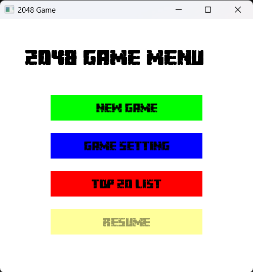
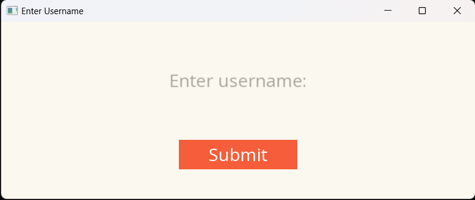
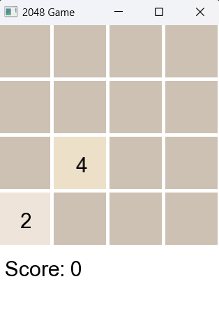
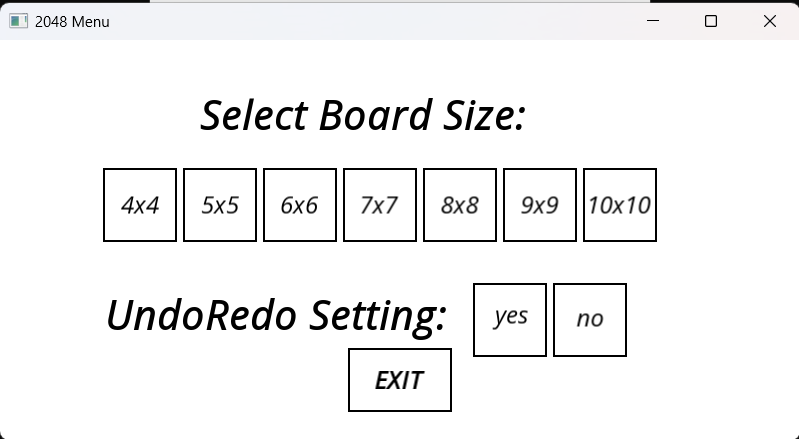
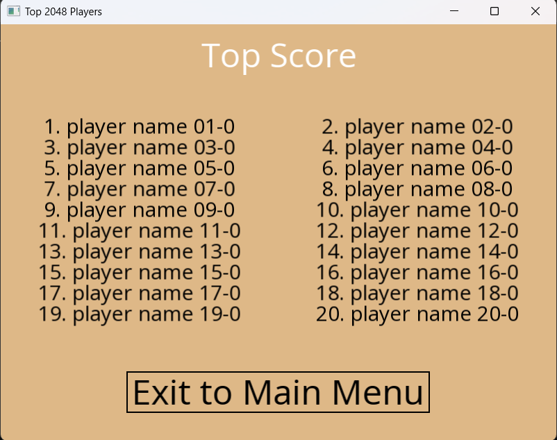
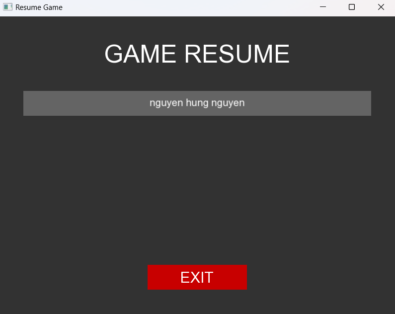

# 2048 game

Đây là 1 dự án về trò chơi 2048 bằng C++, mục tiêu của trò chơi là di chuyển các ô vuông sao cho có 1 ô bất kỳ đạt giá trị là 2048 để giành chiến thắng.

# Giới thiệu

## Tác giả:

- **Họ và tên**: Nguyễn Hưng Nguyên
- **MSSV**: 23120149
- **Thời gian hoàn thiện**: Ngày 13/06/2024

## Cài đặt:

Chạy source code 23120149.sln

## Luật chơi:

- Trò chơi bắt đầu trên 1 lưới ô vuông 4x4 (hoặc lớn hơn, tùy vào setting của người chơi) với hai ô có giá trị ngẫu nhiên (2 hoặc 4).
- Người chơi sử dụng các phím mũi tên (**lên, xuống, trái, phải**) hoặc các phím chữ (**W, A, S, D**) để thực hiện việc di chuyển các ô vuông.
- Khi 2 ô vuông có cùng 1 giá trị đụng vào nhau, chúng sẽ tạo nên 1 ô vuông có giá trị gấp đôi (ví dụ: 2 + 2 = 4, 4 + 4 = 8).
- Trò chơi kết thúc khi không còn bước di chuyển hợp lệ nào (không còn khoảng trống và không thể kết hợp các ô vuông).

## Cách thức di chuyển:

- **Phím mũi tên lên (hoặc phím W)**: Di chuyển tất cả các ô vuông lên trên. Các ô vuông sẽ kết hợp nếu có cùng số.
- **Phím mũi tên xuống (hoặc phím S)**: Di chuyển tất cả các ô vuông xuống dưới. Các ô vuông sẽ kết hợp nếu có cùng số.
- **Phím mũi tên trái (hoặc phím A)**: Di chuyển tất cả các ô vuông sang trái. Các ô vuông sẽ kết hợp nếu có cùng số.
- **Phím mũi tên phải (hoặc phím D)**: Di chuyển tất cả các ô vuông sang phải. Các ô vuông sẽ kết hợp nếu có cùng số.

## Phím chức năng:
- **Q: Quit to Menu** - Nhấn phím `Q` để thoát ra menu chính.
- **E: Resume** - Nhấn phím `E` để dừng trò chơi hiện tại và thoát ra menu chính.
- **U: Undo** - Nhấn phím `U` để hoàn tác lần di chuyển trước đó.
- **R: Redo** - Nhấn phím `R` để làm lại lần di chuyển đã hoàn tác.

## Một số tính năng khác:
- Chọn kích thước bảng tùy ý (4x4, 5x5, ... 10x10).
- Điều chỉnh có thể hoặc không thể Undo Redo.

# Cấu trúc dự án

File chính: **23120149.cpp** kết hợp với nhiều file header và file cpp bổ trợ khác

## File chức năng

- **constant.h**, **constant.cpp**: định nghĩa biến cục bộ sử dụng trong toàn bộ trò chơi.
- **menu.h**, **menu.cpp**: Hiển thị menu trò chơi.
- **getUsername.h**, **getUsername.cpp**: Lấy username của người chơi.
- **Playgame.h**, **Playgame.cpp**: Xử lý các sự kiện nhập vào từ bàn phím của người chơi.
- **Display.h**, **Display.cpp**: Hiển thị màn hình lúc chơi game.
- **Settings.h**, **Settings.cpp**: Hiển thị màn hình Settings.
- **TopList.h**, **TopList.cpp**: Lấy danh sách người chơi cao điểm nhất
- **Resume.h**, **Resume.cpp**: Xử lý các tác vụ resume.

## File định nghĩa cấu trúc

- **vector.h**: định nghĩa cấu trúc *vectorh*, có các chức năng tương tự std::vector trong c++
- **stack.h**: định nghĩa cấu trúc *stackh*, có các chức năng tương tự std::stack trong c++, có nhiều thay đổi để phù hợp hơn với project.
- **game2048.h**: định nghĩa cấu trúc *game2048*, có tác dụng tính toán các trạng thái của trò chơi.

# Gameplay

## Menu

- Các chức năng có trên **menu**:
  - **new game**
  - **setting**
  - **Top 20 List**
  - **Resume**
- Người chơi **nhấp chuột** trực tiếp vào chức năng để chọn.

## New game

- Lấy username người chơi
  

  - Người chơi nhập Username vào trò chơi (ký tự chữ, số, ký tự đặc biệt). sẽ có hàm rename để chuẩn hóa username người dùng.

- Hiển thị trò chơi: Người chơi sử dụng các phím như đã hướng dẫn ở trên để di chuyển bảng.
  

## Setting

- Cửa sổ setting: Người chơi nhấp chuột vào lựa chọn.
  

## Top 20 List

- Cửa sổ top 20 List (mặc định), nhấn exit để quay về menu.
  

## Resume

- Cửa sổ resume, nhấn chuột vào tài khoản muốn resume hoặc exit để về menu.
    

